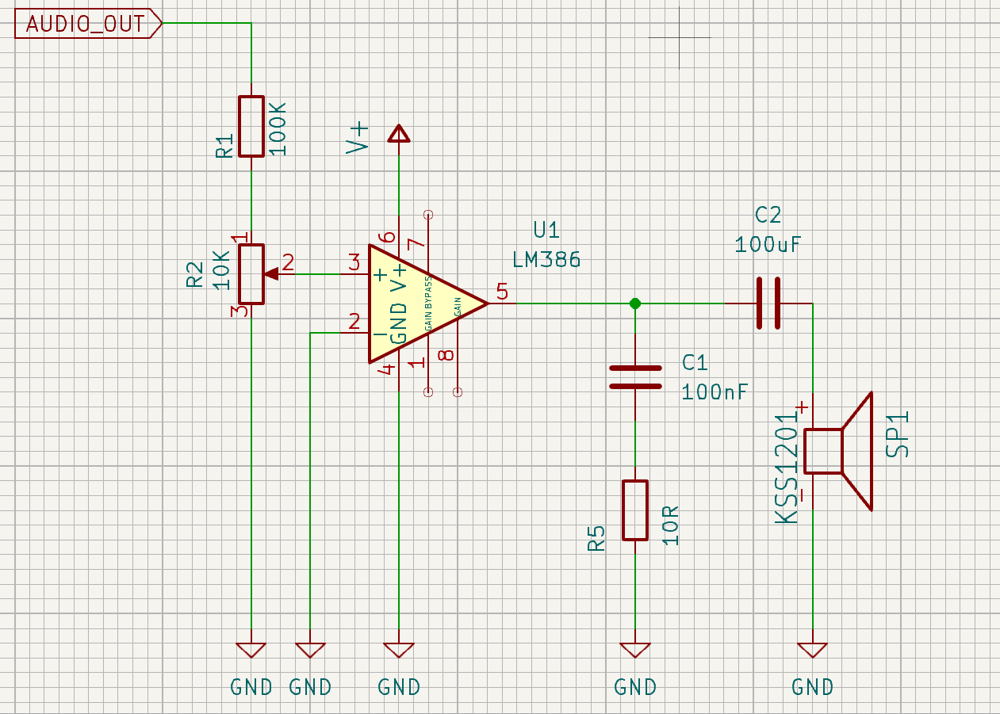
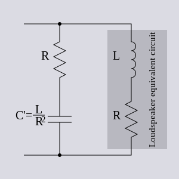

# Zosilňovač audia pomocou LM386
Tento zosilňovač je využitý v schéme zosilňovača v [projekte Deadlock](https://gitlab.com/project-deadlock). 
Tu vysvetlíme výber komponentov, ich funkčnosť a ako voliť hodnoty.

## Charakteristika
Zosilňovač LM386 má minimálny počet externých častí, široký rozsah napätia (4 - 12V) a malý odber prúdu v stave nečinnosti. Poskytuje 20 až 200-násobné zosilnenie. Predvolené nastavenie zosilnenia je 20-násobné, ale pridaním rezistora alebo kondenzátora medzi piny 1 a 8 vieme túto hodnotu zmeniť na hociktorú z rozsahu.

## Konfigurácia pinov LM386
| **Názov** | **Číslo pinu** | **Typ** | **Popis**               |
|-----------|-----------|---------|------------------------------|
| Gain      | 1         | -       | pin na nastavenie zosilnenia |
| - Input   | 2         | I       | invertujúci vstup            |
| + Input   | 3         | I       | neinvertujúci vstup          |
| GND       | 4         | P       | referencia na zem            |
| $V_{out}$ | 5         | O       | výstup                       |
| $V_S$     | 6         | P       | napätie zdroja               |
| Bypass    | 7         | O       | bypass decoupling path       |
| Gain      | 8         | -       | pin na nastavenie zosilnenia |

Pri type: 
- I - Vstup
- O - Výstup
- P - Napájanie

## Odporúčané operačné podmienky LM386
- Napätie zdroja: $4$ až $12V$
- Impedancia reproduktora: $4$ až $32\Omega$
- Vstupné napätie: $-0.4$ -až$0.4V$
- Teplota: $0$ až $70\degree C$

## Schéma
Využívame schému 9.2.1 z [datasheetu](lm386_datasheet.pdf) , ktorú sme si mierne prispôsobili pridaním rezistora **R1**, ktorý spolu s potenciometrom **R2** tvorí napäťový delič a zaručuje, že vstupné napätie bude v odporúčanom rozsahu.

## Komponenty a ich hodnoty
### Rezistor R1 a potenciometer R2
Potenciometer R2 bude slúžiť hlavne na nastavenie hlasitosti a použijeme hodnotu $10k\Omega$, ale jeho hodnota nie je veľmi dôležitá a hodnoty ako $22k\Omega$ alebo $4.7k\Omega$ by fungovali tiež.
Ako už je vyššie spomenuté, tieto komponenty tvoria napäťový delič a ich hodnoty sú zvolené podľa vzorca pre napäťový delič za predpokladu, že $V_{AUDIO\_OUT} = 3.3V$  

$$V_{pin3} = \frac{V_{AUDIO\_OUT} R_2}{(R_1 + R_2)}$$ 

ak chceme dostať hodnotu rezistora $R_1$, tak si vieme vzorec upraviť nasledovne:

$$R_1 = \frac{V_{AUDIO\_OUT} R_2}{V_{pin3}} + R_2$$ 

kde $V_{AUDIO\_OUT}$ je vstupný signál a $V_{pin3}$ je napätie, ktoré nám potečie na pin 3, ktoré už je v odporúčanom rozsahu z datasheetu. Po dosadení hodnôt dostaneme $R_1 = 100k\Omega$.
Pre naše využitie to teda bude $R_1 = 100k\Omega$ a $R_2 = 10k\Omega$.

### Integrovaný obvod IC1
Toto je náš zosilňovač, ktorý zaručí funkčnosť reproduktoru.
Zosilnenie sa dá nastaviť nasledovne:
1. Predvolené (minimálne) zosilnenie- 20x - nič nie je pripojené medzi piny 1 a 8
2. Maximálne zosilnenie - 200x - medzi pinmi 1 a 8 pripojíme kondenzátor
3. Vlastné zosilnenie - medzi piny 1 a 8 pripojíme kondenzátor a rezistory

Na výpočet zosilnenia  môžeme využiť nasledovný vzorec:

 $$Gain = 2 \frac{Z_{1-5}}{150 + Z_{1-8}}$$

kde $Z_{1-5}$ je impedancia medzi pinmi 1 a 5 a $Z_{1-8}$ je impedancia medzi pinmi 1 a 8.

Pri vyššom zosilnení je potrebné na pin 7 pripojiť bypass kondenzátor - zvyčajne $0.1\mu F$, alebo tento pin uzemniť.
Pin 4 zapojíme na zem, rovnako ako aj invertujúci pin 2.
Z pinu 5 nám pôjde výstup - zosilnený signál.

### Kondenzátor C4 a rezistor R5
Spolu tvoria Boucherot cell - elektronický filter, ktorý tlmí vysokofrekvenčné oscilácie, ktoré sa môžu vyskytnúť pri vyšších frekvenciách. Je potrebný, pretože chceme zabezpečiť aby mal zosilňovač ilúziu rovnakej impedancie zo strany reproduktora pri všetkých frekvenciách. Túto ilúziu 

Na obrázku môžeme vidieť, že reproduktor je zložený z cievky a rezistora. Čím sa cievka viac zahrieva, tým je menej priepustná a obvod sa stáva menej stabilný. Ako protiváhu použijeme  kondenzátor C4 a rezistor R5, ktorých hodnoty sú zvolené podľa obrázka. Keďže náš reproduktor má impedanciu $8\Omega$, tak hodnota $R_5$ by mala byť tiež $8\Omega$, ale kvôli dostupnosti a cene súčiastok si postačíme s hodnotou $10\Omega$.
Kondenzátor by mal mať zvolenú hodnotu podľa vzorca na obrázku: 

$$C = \frac{L}{R^2}$$

kde: 
- $L$ je indukčnosť reproduktoru $SP_1$
- $R$ je impedancia reproduktoru  $SP_1$
- $C$ je hodnota kondenzátoru $C_4$

keďže indukčnosť nášho reproduktoru nie je v [datasheete](K15S-8_datasheet.pdf) spomenutá tak použijeme hodnotu  1mH, ktorá je bežná pre reproduktory v tejto kategórii. Po dosadení dostaneme $C_4 = 100nF$.

Táto dvojica komponentov zároveň odstraňuje šum a praskanie a robí celý obvod viac stabilný.
Ak by sme ešte chceli zvýšiť basy nášho reproduktoru, tak vieme hodnotu $C_5$ mierne zvýšiť.
Pre naše využitie to bude $R_5 = 10\Omega$ a $C_4 = 100nF$.

### Kondenzátor C5
Je to takzvaný coupling kondenzátor, ktorý funguje ako high pass filter, ktorý narozdiel od low pass filtra vyfiltruje frekvencie pod počuteľné spektrum, teda menej ako 20Hz a zároveň odstráni DC zložku napätia zo signálu. Hodnotu $C_5$ chceme voliť vyššiu, rádovo v stovkách až tisíckach  $\mu F$. Pre naše potreby bude stačiť  $C_5 = 100\mu F$. Rovnako ako pri C4 a R5, presnú hodnotu vieme vypočítať cez vzorec: 
$$f_c = \frac{1}{2\pi RC}$$ 
kde: 
- $f_c$ je frekvencia, od ktorej nižšia frekvencia už bude vyfiltrovaná
- $R$ je hodnota reproduktoru  $SP_1$
- $C$ je hodnota kondenzátoru $C_5$

Ak poznáme impedanciu reproduktoru a frekvenciu, ktorú chceme filtrovať, tak vieme použiť odvodený vzorec: 

$$C = \frac{1}{2\pi Rf_c}$$ 

Je dobré spomenúť, že ak reproduktor nie je schopný nejakú frekvenciu prehrať, tak ak máme nastavený high pass filter nižšie, tak ju reproduktor aj tak neprehrá - stačí hodnotu nastaviť podľa [datasheetu reproduktora](K15S-8_datasheet.pdf) - u nás to je približne 200Hz.

### Kondenzátor  C1

V [datasheete LM386](lm386_datasheet.pdf) na strane 17 - časť 10 sa píše, že sa odporúča použiť uzemnený kondenzátor v blízkosti pinu 3.

### Reproduktor SP1
Na LM386 vieme pripojiť hociktorý reproduktor s impedanciou $4 - 32\Omega$, my sme si vybrali s hodnotou $8\Omega$.