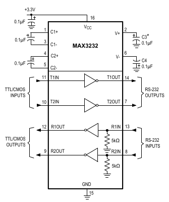

# Ročníkový projekt 2024 

Vrámci tohoto ročníkového projektu sa budeme venovať popisu schém a
konkrétnych súčastí napäťového zdroja a komunikačného rozhrania pre
[UACS (University Access Controll
System)](https://github.com/ostertag/UACS). Tento projekt stavia aj na
poznatkoch z predošlej práce na [projekte
Deadlock](https://gitlab.com/project-deadlock).

## Napäťový zdroj 

Napäťový zdroj nám v našej implementácii slúži na zmenu vstupného
napätia 12 V alebo 5 V na 3.3 V

    
*Schéma zapojenia napäťového zdroja*

Schéma je použitá z [dátového
listu](https://github.com/ostertag/UACS/blob/hardwear_kozuch/power_suply_shc_1/Data_sheet.pdf)
súčiastky MCP16301Hx-xCH, konkrétne Figure 6-1 na strane 23.

    
*Figure 6-1*

Niektoré externé komponenty vieme upraviť, aby sme dostali iné výsledné
napätie, prípadne iný prúd. Naša schéma s ktorou pracujeme predpokladá
vstupné napätie 12V prípadne 5V a výstupné napätie 3.3V. Externé
komponenty sú:

-   rezistory:

    -   rezistory $R_1$ a $R_2$:

        -   v dátovom liste sú to $R_{TOP}$ ($R_1$) a $R_{BOT}$ ($R_2$)

        -   od ich hodnôt závisí výstupné napätie

        -   v dátovom liste máme rovnicu na výpočet odporov jednotlivých
            rezistorov:

            $$R_{1} = R_{2} \times \left(\frac{V_{OUT}}{V_{FB}} - 1\right)$$

        -   naše $V_{OUT}$ je napätie ktoré chceme dostať na výstupe a
            $V_{FB}$ je napätie idúce do $V_{FB}$ pinu a musí mať
            hodnotu 0.8V

        -   na nájdenie hodnôt rezistorov môžeme použiť script
            [find_rezistor.py](https://github.com/ostertag/UACS/tree/hardwear_kozuch/power_suply_shc_1/find_rezistor)

        -   snažíme sa hľadať rezistory z čo najnižších sérii

        -   v dátovom liste uvádzajú že $R_2$ by mal mať 10 $k\Omega$ a
            $R_1$ by mal mať 31.6 $k\Omega$ pre výstupné napätie 3.3V

        -   my použijeme hodnoty ktoré nám našiel skript a to 75
            $k\Omega$ pre $R_1$ a 24 $k\Omega$ pre $R_2$ z dôvodu že
            malé hodnoty odporov majú veľký stratový prúd.

-   kondenzátory:

    -   kondenzátor $C_1$:

        -   v dátovom liste je to aj $C_{IN}$

        -   v dátovom liste je uvedené že treba použiť dva paralelne
            zapojené kondenzátory, každý o hodnote 4.7 µF

        -   používame 10 µF kondenzátor aby sme znížili množstvo
            komponentov a náročnosť zapojenia

    -   kondenzátory $C_3$ a $C_4$:

        -   v dátovom liste je to aj $C_{OUT}$

        -   ich hodnota zavisí od výsledného napätia

        -   pre naše výstupné napätie používame dva kondenzátory každý o
            hodnote 10 µF, ktoré budú paralelne zapojené

    -   pri hodnotách kondenzátorov sa riadime tabuľkou 5-2 na strane
        18:

          |Parameter|   Min   |   Max|
          |-----------|--------|------|
          |$C_{IN}$|    2.2 µF|   None|
          |$C_{OUT}$|   20 µF |   None|

    -   zároveň minimálna napätie kondenzátorov musí byť napätie ktoré
        nimi maximálne môže prechádzať plus nejaká rezerva

        -   Ako rezervu zvyčajne používame hodnotu maximálneho napätia,
            ktoré môže kondenzátorom prechádzať, takže napätie
            kondenzátorov bude dvojnásobkom maximálneho napätia, ktoré
            nimi môže prechádzať.

-   cievka:

    -   používame 15 µH cievku

    -   podľa výstupného napätia upravujeme jej hodnotu podľa tejto
        rovnice:

        $$K = V_{OUT}/L$$

    -   kde K by malo mať hodnotu 0.22 V/µH a $V_{OUT}$ je naše výstupné
        napätie (3.3V)

    -   pre iné napätia sa môžeme riadiť tabuľkou 5-1 na strane 17

          |$V_{OUT}$|   K   |   $L_{STANDART}$|
          |-----------|------|----------------|
          |2.0V       | 0.20 |  10 µH|
          |3.3V       | 0.22 |  15 µH|
          |5.0V       | 0.23 |  22 µH|
          |12V        | 0.21 |  56 µH|
          |15V        | 0.22 |  68 µH|

-   ostatné externé komponenty aj ich charakteristiky vieme nájsť v
    dátovom liste na stranách 19 až 20

-   v pôvodnom návrhu z projektu Deadlock, bola v schéme umiestnená
    dióda BAT54, nakoľko si nie sme istý dôvodom umiestnenia tejto
    diódy, je pri nej v schéme otáznik

## Komunikačné rozhranie 

*Schéma zapojenia komunikačného rozhrania*

Komunikačné rozhranie sa skladá z dvoch komponentov:

-   RJ12 konektor 6p6c:

    -   slúži na komunikáciu s externou súčiastkou, ktorá môže byť
        pripojená prostredníctvom kábla s RJ12 konektormi

    -   slúži zároveň aj ako napájanie celého zariadenia napätím medzi
        4V až 15V

    -   funkcie jednotlivých pinov konektora sú v tejto tabuľke:

          |Pin |  Funkcia|
          |-----|-----------|
          |1    |  RST|
          |2    | Napájanie|
          |3     |Receive|
          |4     |Transmit|
          |5     |Zem|
          |6     |BOOT0|

    -   pin1 budeme používať pre RST signál

    -   pin2 budeme používať pre napájanie

    -   pin3 budeme používať na prijímanie signálu do nášho MCU, zatiaľ
        čo na druhej strane kábla bude použitý na vysielanie

    -   pin4 budeme používať na odosielanie signálu z nášho MCU, zatiaľ
        čo na druhej strane kábla bude použitý na prijímanie

    -   pin5 pripojíme na zem

    -   pin6 budeme používať pre BOOT0 signál

-   MAX3232

    -   schému zapojenia používame z [dátového listu](https://github.com/ostertag/UACS/blob/hardwear_kozuch/rs-232_interface/Data_sheet.pdf)
        zo strany 12

        
        *Schéma z dátového listu na strane 12*

    -   vrámci RS-232 štandardu sú napätia pre logickú jednotku a nulu
        definované takto:

      | Logická hodnota|     Napätie|
      |----------------- |------------|
       |      0        |  +3 až +15 V |
      |        1       |   -15 až -3 V |

    -   pri prijímaní signálu MAX 3232 konvertuje vstupné napätie na
        napätie pre logickú nulu (0V až 0.8V) alebo jednotku(2V až 3.3V)

    -   pri odosielaní signálu konvertuje napätie logickej nuly alebo
        jednotky na napätie +5V až +5.4V alebo -5V až -5.4V

    -   pre podrobnejšie informácie treba pozrieť tabuľku na strane na
        strane 2 až 3 (Electrical Characteristics)

    -   funkcie jednotlivých pinov sú v tejto tabuľke, nájdeme ju na
        strane 6 v dátovom liste:

      |Pin     | Meno       |Funkcia|
      |--------|----------|------------------------------------------------------------|
      |1         |C1+        |Positive Terminal of Voltage-Doubler Charge-Pump Capacitor|
      |2        |V+         |+5.5V Generated by the Charge Pump|
      |3        |C1-        |Negative Terminal of Voltage-Doubler Charge-Pump Capacitor|
      |4        |C2+        |Positive Terminal of Inverting Charge-Pump Capacitor|
      |5        |C2-        |Negative Terminal of Inverting Charge-Pump Capacitor|
      |6        |V-         |-5.5V Generated by the Charge Pump|
      |7,14     |T_OUT      |RS-232 Transmitter Outputs|
      |8,13     |R_IN       |RS-232 Receiver Inputs|
      |9,12     |R_OUT      |TTL/CMOS Receiver Outputs|
      |10, 11   |T_IN       |TTL/CMOS Transmitter Inputs|
      |15       |GND        |Ground|
      |16       |$V_{CC}$  | +3.0V to +5.5V Supply Voltage|

    -   piny 1 až 6 sú súčasťou takzvanej "Charge pump"

        -   slúži na zvýšenie napätia, aj keď vstupné napätie je nižšie

        -   v našom prípade zvyšuje zo vstupného napätia 3.3V na 5.5V
            alebo -5.5V

    -   piny 7 a 14 posielajú výstupný signál o hodnote medzi -3V až -15
        V alebo 3V až 15V

    -   piny 8 a 13 prijímajú vstupný signál o hodnote medzi -3V až -15
        V alebo 3V až 15V

    -   piny 9 a 12 posielajú výstupný signál ktorý je buď logická nula
        alebo jednotka

    -   piny 10 a 11 prijímajú vstupný signál ktorý je buď logická nula
        alebo jednotka

    -   pin 15 je uzemnený

    -   pin 16 je určený pre napájanie súčiastky

    -   v našej implementácii:

        -   pre posielanie signálov používame dvojicu pinov 11 a 14

        -   pre prijímanie signálov používame dvojicu pinov 12 a 13

    -   jediné externé súčiastky sú kondenzátory, ich minimálne hodnoty
        pre dané napätie sú v tabuľke 2 na strane 9:

          |$V_{CC}$ (V) |  C1 (µF) |  C2, C3, C4 (µF)|
          |-------------- |--------- |-----------------|
          |to 3.6        | 0.1       |0.1 |
          |4.5 to 5.5    | 0.047    | 0.33 |
          |3.0 to 5.5    | 0.1     |  0.47 |

    -   vieme použiť vyššie hodnoty kondenzátorov, zvlášť ak
        kondenzátory ktoré používame menia svoju hodnotu s rastúcou
        teplotou

    -   ak chceme zvýšiť hodnotu kondenzátora C1 musíme zvýšiť aj
        hodnoty ostatných kondenzátorov

    -   pri zvyšovaní hodnôt kondenzátorov C2 , C3 a C4 nemusíme
        zvyšovať hodnotu kondenzátora C1

    -   kondenzátor C5 používame v prípade ak je naša implementácia
        citlivá na "hluk" zdroja

    -   kondenzátor C5 bude mať rovnakú hodnotu ako kondenzátor C1

    -   pre viacej detailov ohľadom kondenzátorov pozri strany 8, 9
        (Capacitor Selection, Power-Supply Decoupling) v dátovom liste

    -   piny ktoré nebudú na nič pripojené, pripojíme na zem, prípadne
        na $V_{cc}$ (pozri stranu 7 - RS-232 Transmitters v dátovom
        liste)

Deadlock reader documentation
[\<https://gitlab.com/project-deadlock/\>](https://gitlab.com/project-deadlock/)
UACS documentation    
[\<https://github.com/ostertag/UACS\>](https://github.com/ostertag/UACS)    
Dej, A. 2018. Design and implementation of embedded components of an
RFID access control system (2018)    

