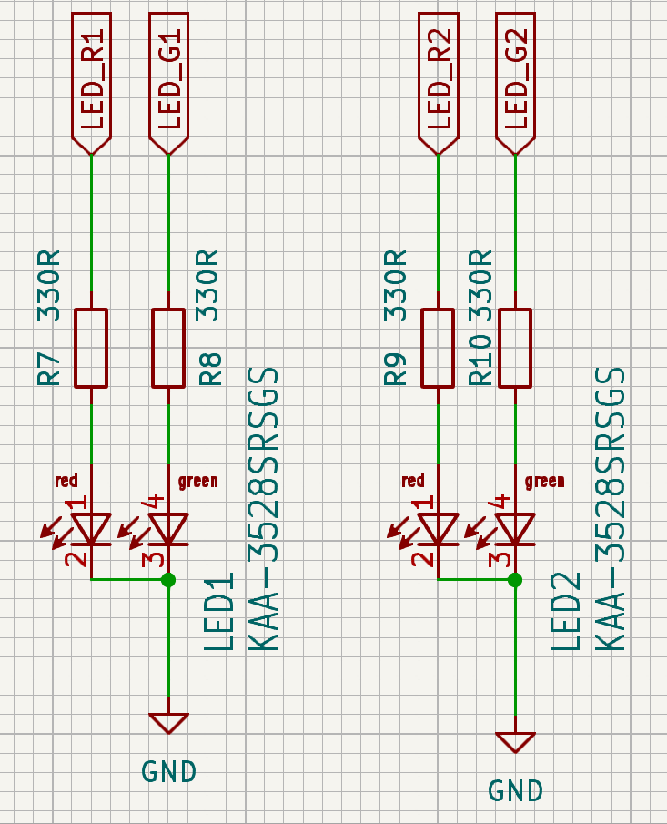

# LED KAA-3528SRSGS

Tieto LED diódy sú využité v schéme readera v [projekte Deadlock](https://gitlab.com/project-deadlock). 

## Schéma zapojenia

Používame odporúčanú schému zapojenia z [dátového listu](KAA-3528SRSGS_datasheet_1.pdf) na strane 6

## Komponenty v obvode

### LED diódy $LED_1$ a $LED_2$ 

Skladajú sa z 2 diód - zelenej a červenej farby, ktoré sa dajú nezávisle na sebe ovládať.

| **Parameter**   | **Červená** | **Zelená** | **Jednotka** |
|-----------------|-------------|------------|--------------|
| Kapacita        | 45          | 15         | pF           |
| Forward Voltage | 1.85        | 2.2        | V            |
| Max. forward Current | 30          | 25         | mA           |

V tabuľke vyššie vidíme pre nás dôležité parametre z tabuliek v [dátovom liste](KAA-3528SRSGS_datasheet_2.pdf) na strane 3.

### Rezistory

Vybrali sme si rezistory s hodnotou $330\Omega$, aby redukovali prúd ktorý tečie cez diódy, aby sa nezničili. Za predpokladu že napätie $V_{in}$, ktoré tečie do každého rezistoru je $5V$, tak vieme vypočítať prúd podľa [tohto vzorca](https://www.digikey.com/en/resources/conversion-calculators/conversion-calculator-led-series-resistor): 

$$I = \frac{V_{in} - V_{fw}}{R}$$

kde: 
- $V_{in}$ je vstupné napätie
- $V_{fw}$ je forward voltage konkrétnej diódy
- $R$ je impedancia rezistora pred diódou

Po dosadení hodnôt dostaneme pre červenú diódu hodnotu $9mA$. Výpočet:

$$I = \frac{V_{inRed} - V_{fwRed}}{R_{red}} = \frac{5 -1.85}{330} =  9mA$$

 Po dosadení hodnôt dostaneme pre zelenú diódu hodnotu $8.5mA$. Výpočet: 

$$I = \frac{V_{inGreen} - V_{fwGreen}}{R_{green}} = \frac{5 -2.2}{330} =  8.5mA$$

Tieto hodnoty sú nižšie ako max. forward current, takže nám vyhovujú.

V dátovom liste sa tiež píše, že sa odporúča použiť prúd 20mA. Ak by sme sa chceli riadiť týmto odporúčaním, tak by sme pre výpočet rezistora použili vzorec:

$$R = \frac{V_{in} - V_{fw}}{I}$$

Pre červenú diódu to bude: 

$$R = \frac{V_{in} - V_{fw}}{I} = \frac{5 - 1.85}{20 \times 10^{-3}} = 157.5\Omega$$

Pre zelenú diódu to bude: 

$$R = \frac{V_{in} - V_{fw}}{I} = \frac{5 - 2.2}{20 \times 10^{-3}} = 140\Omega$$

Vybrali by sme si teda rezistor so strednou hodnotou $150\Omega$, kde by cez červenú diódu tiekol prúd 21mA a cez zelenú 19mA, čo sú hodnoty z rozsahu.
