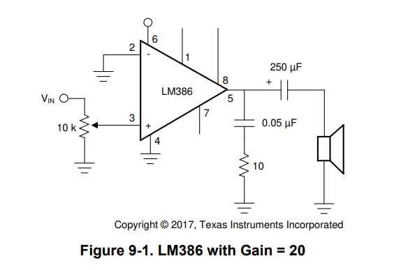
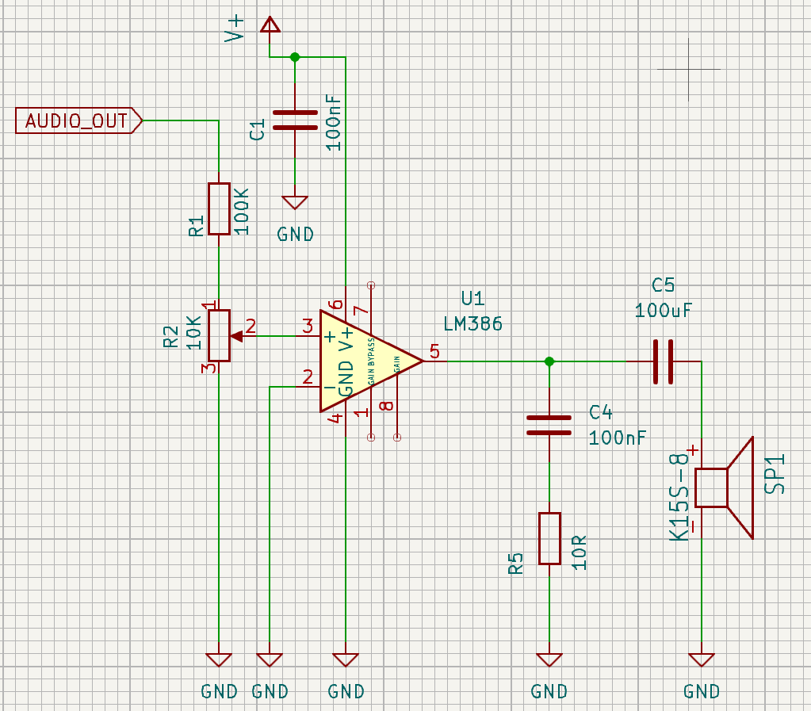
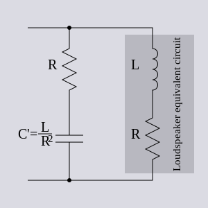
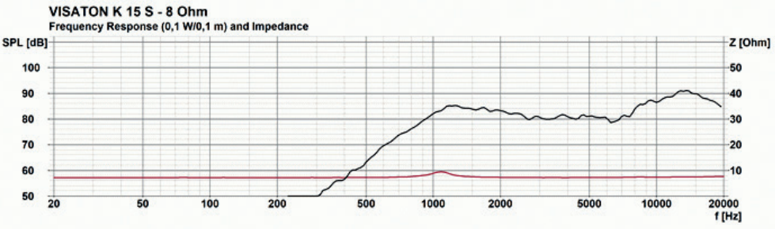
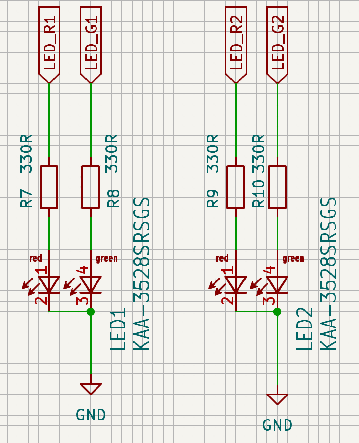

# Zosilňovač audia pomocou LM386

Tento zosilňovač je využitý v schéme zosilňovača v [projekte Deadlock](https://gitlab.com/project-deadlock). 
Tu vysvetlíme výber komponentov, ich funkčnosť a ako voliť hodnoty.

## Charakteristika

Zosilňovač LM386 má minimálny počet externých častí, široký rozsah napätia (4 - 12V) a malý odber prúdu v stave nečinnosti. Poskytuje 20 až 200-násobné zosilnenie. Predvolené nastavenie zosilnenia je 20-násobné, ale pridaním rezistora alebo kondenzátora medzi piny 1 a 8 vieme túto hodnotu zmeniť na hociktorú z rozsahu.

## Konfigurácia pinov LM386

| **Názov** | **Číslo pinu** | **Typ** | **Popis**                                               |
| --------- | :------------: | :-----: | ------------------------------------------------------- |
| Gain      |       1        |    -    | pin na nastavenie zosilnenia                            |
| - Input   |       2        |    I    | invertujúci vstup                                       |
| + Input   |       3        |    I    | neinvertujúci vstup                                     |
| GND       |       4        |    P    | referencia na zem                                       |
| $V_{out}$ |       5        |    O    | výstup                                                  |
| $V_S$     |       6        |    P    | napätie zdroja                                          |
| Bypass    |       7        |    O    | bypass decoupling path                                  |
| Gain      |       8        |    -    | pin na nastavenie zosilnenia                            |

Pri type:

- I - Vstup
- O - Výstup
- P - Napájanie

## Odporúčané operačné podmienky LM386

- Napätie zdroja: $4$ až $12V$
- Impedancia reproduktora: $4$ až $32\Omega$
- Vstupné napätie: $-0.4$ až $0.4V$
- Teplota: $0$ až $70$$^\circ C$ 

## Schéma

Využívame schému 9.2.1 z [dátového listu](lm386_datasheet.pdf) , ktorú sme si mierne prispôsobili pridaním rezistora $R_1$, ktorý spolu s potenciometrom $R_2$ tvorí napäťový delič a zaručuje, že vstupné napätie bude v odporúčanom rozsahu (maximálne 0.4V pri vstupnom napätí 3.3V).

## Komponenty a ich hodnoty

### Rezistor $R_1$ a potenciometer $R_2$

Potenciometer $R_2$ bude slúžiť hlavne na nastavenie hlasitosti a použijeme hodnotu $10k\Omega$, ale jeho hodnota nie je veľmi dôležitá, kým je dostatočne vysoká. Hodnoty ako $22k\Omega$ alebo $4.7k\Omega$ by fungovali tiež.
Ako už je vyššie spomenuté, tieto komponenty tvoria napäťový delič a ich hodnoty sú zvolené podľa [vzorca pre napäťový delič](https://www.digikey.lv/en/resources/conversion-calculators/conversion-calculator-voltage-divider) za predpokladu, že $V_{AUDIO\_OUT} = 3.3V$  

$$V_{pin3} = \frac{V_{AUDIO\_OUT} R_2}{(R_1 + R_2)}$$ 

ak chceme dostať hodnotu rezistora $R_1$, tak si vieme vzorec upraviť nasledovne:

$$R_1 = \frac{V_{AUDIO\_OUT} R_2}{V_{pin3}} + R_2$$ 

kde $V_{AUDIO\_OUT}$ je vstupný signál a $V_{pin3}$ je napätie, ktoré nám potečie na pin 3, ktoré už je v odporúčanom rozsahu z dátového listu. Po dosadení hodnôt dostaneme $R_1 = 100k\Omega$.

môžeme overiť, či sme vybrali správnu hodnotu rezistoru dosadením do vzorca a overením, či $V_{pin3}$ je v norme:

$$V_{pin3} = \frac{3.3 \times 10 \times 10^{3} }{(100 \times 10^{3} + 10 \times 10^{3})} = \frac{3}{10}V$$ 

Pre naše využitie to teda bude $R_1 = 100k\Omega$ a $R_2 = 10k\Omega$.

### Integrovaný obvod $IC_1$

Toto je náš zosilňovač, ktorý zaručí funkčnosť reproduktoru.
Zosilnenie sa dá nastaviť nasledovne:

1. Predvolené (minimálne) zosilnenie- 20x - nič nie je pripojené medzi piny 1 a 8
2. Maximálne zosilnenie - 200x - medzi pinmi 1 a 8 pripojíme kondenzátor
3. Vlastné zosilnenie - medzi piny 1 a 8 pripojíme kondenzátor a rezistory

Na výpočet zosilnenia  môžeme využiť nasledovný [vzorec](https://www.electrosmash.com/lm386-analysis#lm386input):

 $$Gain = 2 \frac{Z_{1-5}}{150 + Z_{1-8}}$$

kde $Z_{1-5}$ je impedancia medzi pinmi 1 a 5 a $Z_{1-8}$ je impedancia medzi pinmi 1 a 8.

Pri vyššom zosilnení je potrebné na pin 7 pripojiť bypass kondenzátor - zvyčajne $0.1\mu F$, prípadne tento pin uzemniť.
Pin 4 zapojíme na zem, rovnako ako aj invertujúci pin 2.
Z pinu 5 nám pôjde výstup - zosilnený signál.

### Kondenzátor $C_4$ a rezistor $R_5$

Spolu tvoria Boucherot cell - elektronický filter, ktorý tlmí vysokofrekvenčné oscilácie, ktoré sa môžu vyskytnúť pri vyšších frekvenciách. Je potrebný, pretože chceme zabezpečiť, aby mal zosilňovač ilúziu rovnakej impedancie zo strany reproduktora pri všetkých frekvenciách. 

Na obrázku môžeme vidieť, že reproduktor je zložený z cievky a rezistora. Čím sa cievka viac zahrieva, tým je menej priepustná a obvod sa stáva menej stabilný. Ako protiváhu použijeme  kondenzátor C4 a rezistor R5, ktorých hodnoty sú zvolené podľa obrázka. Keďže náš reproduktor má impedanciu $8\Omega$, tak hodnota $R_5$ by mala byť tiež $8\Omega$, ale kvôli dostupnosti a cene súčiastok si postačíme s hodnotou $10\Omega$.
Kondenzátor by mal mať zvolenú hodnotu podľa vzorca na obrázku: 

$$C = \frac{L}{R^2}$$

kde: 

- $L$ je indukčnosť reproduktoru $SP_1$
- $R$ je impedancia reproduktoru  $SP_1$
- $C$ je hodnota kondenzátoru $C_4$

keďže indukčnosť nášho reproduktoru nie je v [dátovom liste](K15S-8_datasheet.pdf) spomenutá tak použijeme hodnotu  1mH, ktorá je bežná pre reproduktory v tejto kategórii. Po dosadení dostaneme $C_4 = 100nF$.

Táto dvojica komponentov zároveň odstraňuje šum a praskanie a robí celý obvod viac stabilný.
Ak by sme ešte chceli zvýšiť basy nášho reproduktoru, tak vieme hodnotu $C_5$ mierne zvýšiť.
Pre naše využitie to bude $R_5 = 10\Omega$ a $C_4 = 100nF$.

### Kondenzátor $C_5$

Je to takzvaný coupling kondenzátor, ktorý funguje ako high pass filter, ktorý narozdiel od low pass filtra vyfiltruje frekvencie pod počuteľné spektrum, teda menej ako 20Hz a zároveň odstráni DC zložku napätia zo signálu. Hodnotu $C_5$ chceme voliť vyššiu, rádovo v stovkách až tisíckach  $\mu F$. Pre naše potreby bude stačiť  $C_5 = 100\mu F$. Využijeme vzorec pre high pass filter:
$$f_c = \frac{1}{2\pi RC}$$ 
kde: 

- $f_c$ je frekvencia, od ktorej nižšia frekvencia už bude vyfiltrovaná
- $R$ je hodnota reproduktoru  $SP_1$
- $C$ je hodnota kondenzátoru $C_5$

Ak poznáme impedanciu reproduktoru a frekvenciu, ktorú chceme filtrovať, tak vieme použiť odvodený vzorec: 

$$C = \frac{1}{2\pi Rf_c}$$ 

Je dobré spomenúť, že ak reproduktor nie je schopný nejakú frekvenciu prehrať, tak ak máme nastavený high pass filter nižšie, tak ju reproduktor aj tak neprehrá - stačí hodnotu nastaviť podľa [dátového listu reproduktora](K15S-8_datasheet.pdf) - u nás to je približne 200Hz, takže bude stačiť hodnota  $C_5 = 100\mu F$.

### Kondenzátor $C_1$

V [dátovom liste LM386](lm386_datasheet.pdf) na strane 17 - časť 10 sa píše, že sa odporúča použiť uzemnený kondenzátor v blízkosti pinu 3.

### Reproduktor $SP_1$

Na LM386 vieme pripojiť hociktorý reproduktor s impedanciou $4 - 32\Omega$, my sme si vybrali s hodnotou $8\Omega$. Ako je vyššie spomenuté a viditeľné v grafe nižšie, reproduktor nedokáže prehrať frekvenciu nižšiu ako približne 200Hz.

# LED KAA-3528SRSGS

Tieto LED diódy sú využité v schéme readera v [projekte Deadlock](https://gitlab.com/project-deadlock). 

## Schéma zapojenia

Používame odporúčanú schému zapojenia z [dátového listu](KAA-3528SRSGS_datasheet_1.pdf) na strane 6

## Komponenty v obvode

### LED diódy $LED_1$ a $LED_2$ 

Skladajú sa z 2 diód - zelenej a červenej farby, ktoré sa dajú nezávisle na sebe ovládať.

| **Parameter**   | **Červená** | **Zelená** | **Jednotka** |
|-----------------|-------------|------------|--------------|
| Kapacita        | 45          | 15         | pF           |
| Forward Voltage | 1.85        | 2.2        | V            |
| Max. forward Current | 30          | 25         | mA           |

V tabuľke vyššie vidíme pre nás dôležité parametre z tabuliek v [dátovom liste](KAA-3528SRSGS_datasheet_2.pdf) na strane 3.

### Rezistory

Vybrali sme si rezistory s hodnotou $330\Omega$, aby redukovali prúd ktorý tečie cez diódy, aby sa nezničili. Za predpokladu že napätie $V_{in}$, ktoré tečie do každého rezistoru je $5V$, tak vieme vypočítať prúd podľa [tohto vzorca](https://www.digikey.com/en/resources/conversion-calculators/conversion-calculator-led-series-resistor): 

$$I = \frac{V_{in} - V_{fw}}{R}$$

kde: 
- $V_{in}$ je vstupné napätie
- $V_{fw}$ je forward voltage konkrétnej diódy
- $R$ je impedancia rezistora pred diódou

Po dosadení hodnôt dostaneme pre červenú diódu hodnotu $9mA$. Výpočet:

$$I = \frac{V_{inRed} - V_{fwRed}}{R_{red}} = \frac{5 -1.85}{330} =  9mA$$

 Po dosadení hodnôt dostaneme pre zelenú diódu hodnotu $8.5mA$. Výpočet: 

$$I = \frac{V_{inGreen} - V_{fwGreen}}{R_{green}} = \frac{5 -2.2}{330} =  8.5mA$$

Tieto hodnoty sú nižšie ako max. forward current, takže nám vyhovujú.

V dátovom liste sa tiež píše, že sa odporúča použiť prúd 20mA. Ak by sme sa chceli riadiť týmto odporúčaním, tak by sme pre výpočet rezistora použili vzorec:

$$R = \frac{V_{in} - V_{fw}}{I}$$

Pre červenú diódu to bude: 

$$R = \frac{V_{in} - V_{fw}}{I} = \frac{5 - 1.85}{20 \times 10^{-3}} = 157.5\Omega$$

Pre zelenú diódu to bude: 

$$R = \frac{V_{in} - V_{fw}}{I} = \frac{5 - 2.2}{20 \times 10^{-3}} = 140\Omega$$

Vybrali by sme si teda rezistor so strednou hodnotou $150\Omega$, kde by cez červenú diódu tiekol prúd 21mA a cez zelenú 19mA, čo sú hodnoty z rozsahu.
