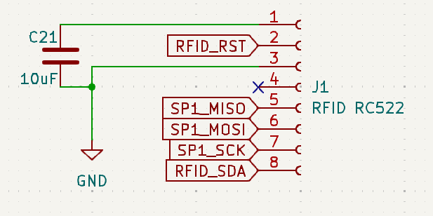

    
Čítačku RFID kariet RC522 pripojíme k nášmu PCB cez 
8 pinový konektor.  Jednotlivé funkcie pinov sú v tejto 
tabuľke:    
|Číslo pinu|Meno pinu|Funkcionalita pinu|   
|-|---------|------------------|   
|1|VCC|Pripojenie k 3.3 voltom|   
|2|RST|Resetuje modul|   
|3|GND|Pripojenie k zemi|   
|4|IRQ|Upozorní MCU ak sa k anténe priblíži RFID čip|
|5|MISO|Master-In-Slave-Out pri SPI rozhraní|   
|6|MOSI|Master Out Slave In pri SPI rozhraní|   
|7|SCK|Serial Clock, akceptuje hodinové pulzy z SPI rozhrania|   
|8|SDA|Signal input pri SPI rozhraní|   

Medzi VCC a GND pin pripojíme ešte 10uF kondenzátor kvôli ochrane signálu.   
IRQ pin nebudeme zapájať, keďže ho v našej implementácii nevyužijeme.

