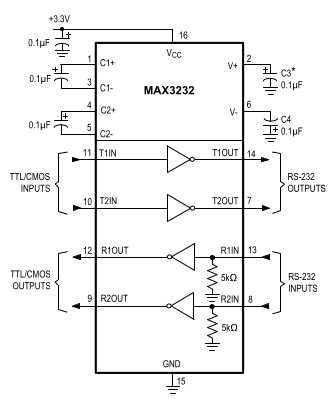

## Komunikačné rozhranie 

*Schéma zapojenia komunikačného rozhrania*

Komunikačné rozhranie sa skladá z dvoch komponentov:

-   RJ12 konektor 6p6c:

    -   slúži na komunikáciu s externou súčiastkou, ktorá môže byť
        pripojená prostredníctvom kábla s RJ12 konektormi

    -   slúži zároveň aj ako napájanie celého zariadenia napätím medzi
        4V až 15V

    -   funkcie jednotlivých pinov konektora sú v tejto tabuľke:

          |Pin |  Funkcia|
          |-----|-----------|
          |1    |  RST|
          |2    | Napájanie|
          |3     |Receive|
          |4     |Transmit|
          |5     |Zem|
          |6     |BOOT0|

    -   pin1 budeme používať pre RST signál

    -   pin2 budeme používať pre napájanie

    -   pin3 budeme používať na prijímanie signálu do nášho MCU, zatiaľ
        čo na druhej strane kábla bude použitý na vysielanie

    -   pin4 budeme používať na odosielanie signálu z nášho MCU, zatiaľ
        čo na druhej strane kábla bude použitý na prijímanie

    -   pin5 pripojíme na zem

    -   pin6 budeme používať pre BOOT0 signál

-   MAX3232

    -   schému zapojenia používame z [dátového listu](https://github.com/ostertag/UACS/blob/hardwear_kozuch/rs-232_interface/Data_sheet.pdf)
        zo strany 12

        
        *Schéma z dátového listu na strane 12*

    -   vrámci RS-232 štandardu sú napätia pre logickú jednotku a nulu
        definované takto:

      | Logická hodnota|     Napätie|
      |----------------- |------------|
       |      0        |  +3 až +15 V |
      |        1       |   -15 až -3 V |

    -   pri prijímaní signálu MAX 3232 konvertuje vstupné napätie na
        napätie pre logickú nulu (0V až 0.8V) alebo jednotku(2V až 3.3V)

    -   pri odosielaní signálu konvertuje napätie logickej nuly alebo
        jednotky na napätie +5V až +5.4V alebo -5V až -5.4V

    -   pre podrobnejšie informácie treba pozrieť tabuľku na strane na
        strane 2 až 3 (Electrical Characteristics)

    -   funkcie jednotlivých pinov sú v tejto tabuľke, nájdeme ju na
        strane 6 v dátovom liste:

      |Pin     | Meno       |Funkcia|
      |--------|----------|------------------------------------------------------------|
      |1         |C1+        |Positive Terminal of Voltage-Doubler Charge-Pump Capacitor|
      |2        |V+         |+5.5V Generated by the Charge Pump|
      |3        |C1-        |Negative Terminal of Voltage-Doubler Charge-Pump Capacitor|
      |4        |C2+        |Positive Terminal of Inverting Charge-Pump Capacitor|
      |5        |C2-        |Negative Terminal of Inverting Charge-Pump Capacitor|
      |6        |V-         |-5.5V Generated by the Charge Pump|
      |7,14     |T_OUT      |RS-232 Transmitter Outputs|
      |8,13     |R_IN       |RS-232 Receiver Inputs|
      |9,12     |R_OUT      |TTL/CMOS Receiver Outputs|
      |10, 11   |T_IN       |TTL/CMOS Transmitter Inputs|
      |15       |GND        |Ground|
      |16       |$V_{CC}$  | +3.0V to +5.5V Supply Voltage|

    -   piny 1 až 6 sú súčasťou takzvanej "Charge pump"

        -   slúži na zvýšenie napätia, aj keď vstupné napätie je nižšie

        -   v našom prípade zvyšuje zo vstupného napätia 3.3V na 5.5V
            alebo -5.5V

    -   piny 7 a 14 posielajú výstupný signál o hodnote medzi -3V až -15
        V alebo 3V až 15V

    -   piny 8 a 13 prijímajú vstupný signál o hodnote medzi -3V až -15
        V alebo 3V až 15V

    -   piny 9 a 12 posielajú výstupný signál ktorý je buď logická nula
        alebo jednotka

    -   piny 10 a 11 prijímajú vstupný signál ktorý je buď logická nula
        alebo jednotka

    -   pin 15 je uzemnený

    -   pin 16 je určený pre napájanie súčiastky

    -   v našej implementácii:

        -   pre posielanie signálov používame dvojicu pinov 11 a 14

        -   pre prijímanie signálov používame dvojicu pinov 12 a 13

    -   jediné externé súčiastky sú kondenzátory, ich minimálne hodnoty
        pre dané napätie sú v tabuľke 2 na strane 9:

          |$V_{CC}$ (V) |  C1 (µF) |  C2, C3, C4 (µF)|
          |-------------- |--------- |-----------------|
          |to 3.6        | 0.1       |0.1 |
          |4.5 to 5.5    | 0.047    | 0.33 |
          |3.0 to 5.5    | 0.1     |  0.47 |

    -   vieme použiť vyššie hodnoty kondenzátorov, zvlášť ak
        kondenzátory ktoré používame menia svoju hodnotu s rastúcou
        teplotou

    -   ak chceme zvýšiť hodnotu kondenzátora C1 musíme zvýšiť aj
        hodnoty ostatných kondenzátorov

    -   pri zvyšovaní hodnôt kondenzátorov C2 , C3 a C4 nemusíme
        zvyšovať hodnotu kondenzátora C1

    -   kondenzátor C5 používame v prípade ak je naša implementácia
        citlivá na "hluk" zdroja

    -   kondenzátor C5 bude mať rovnakú hodnotu ako kondenzátor C1

    -   pre viacej detailov ohľadom kondenzátorov pozri strany 8, 9
        (Capacitor Selection, Power-Supply Decoupling) v dátovom liste

    -   piny ktoré nebudú na nič pripojené, pripojíme na zem, prípadne
        na $V_{cc}$ (pozri stranu 7 - RS-232 Transmitters v dátovom
        liste)
