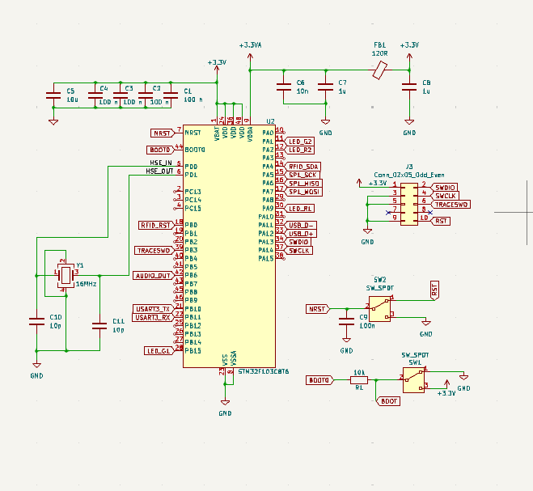
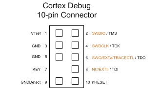

Schému zapojenia nášho microcontrolera vieme rozdeliť na 4 časti:

### 1. Decoupling
Decouplig používame pri pinoch VBAT, VDD a VDDA aby sme  zlepšili stabilitu napájacieho napätia a znížili elektrický šum.   
Pre decoupling pri pinoch VBAT a VDD používame štyri sériovo zapojéne 100 nF kondenzátory, za každý VBAT a VDD pin jeden, a jeden 4.7 μF kondenzátor.  Avšak mi použijeme 10 μF kondenzátor, kvôli dostupnosti súčiastok nech môžeme nakupovať viac súčiastok z jedného druhu. 10 μF sa bežne vyskytuje v rôznych schémach s naším modelom STM32, napríklad aj v tom [videu](https://youtu.be/aVUqaB0IMh4?si=yPWBV3e04wY7MyOk&t=697). 
Pre decoupling pri pine VDDA používame seriovo zapojený 10nF a 1uF kondenzátor. Pre pripojenie k 3.3 voltom pridáme 100 ohmový Ferite Bead a 1uF kondenzátor pre pripojenie k zemi.  
Pri týchto hodnotách pre komponenty vychádzame zo schémy 14 na strane 36 z [datasheetu](data_sheet.pdf) a aj z hore zmieneného videa.

### 2. Externý oscilátor
Náš STM32 mikrokontolér má síce vnútorný oscilátor ale aby sme mohli používať pripojenie cez USB tak potrebujeme pripojiť externý oscilátor. 
K oscilátoru budeme musieť pripojiť dva 10pF kondenzátory. Tieto hodnoty výchádzajú z [AN2867](an2867.pdf) z rovnice:

$$C_{L} = \frac{C_{L1} * C_{L2}}{C_{L1}+C_{L2}}+ C_{S} $$

Kde:
- $C_L$ je záťažová kapacita oscilátora, u nás to je 10 pF, kedže chceme použiť tento 
[oscilator]()  
- $C_S$ je rozptylová kapacita dosky plošných spojov, zvyčajne je medzi 2 až 7 pF, my použijeme hodnotu 5 pF 
- $C_{L1}$ a $C_{L2}$ sú hodnoty kondenzátorov a teda   
$$C_{L1} = C_{L2} = 10 pF  $$

### 3. Prepínače pri pinoch NRST a BOOT0
Chceme aby sme vedeli náš mikrokontolér resetovať manuálne ale aj pomocou signálov. Preto tieto piny pripojíme k prepínačom 
ale aj k výstupom z RJ12 konektoru a pri NRST pine aj zo SERIAL WIRE DEBUG konektora.
Prepínanie funguje takto:
- Ak je BOOT0 pin stiahnutý na zem tak bootloader skontroluje či je flash pamäť prázdna
  - ak je prázdna tak začne komunikovať s rozhraniami (UART/SWD/USB) aby z nich stiahol program
  - ak nie je práznda, spustí sa kód ktorý je nahratý vo flash pamäti
- Ak na BOOT0 pin privedieme 3.3 volta tak bootloader vyhodnotí že flash pamäť je prázdna
- NRST pin je defaultne na 3.3 volta, vďaka internému pull up resistoru.
- Ak je NRST stiahnutý na zem tak STM32 sa resetne 
- Preto ak RST linku stiahneme na zem, prestaneme na ňu privádzať 3.3V, vieme STM32 resetnut 

Kondenzátor pri pine NRST slúži ako ochrana proti náhodným resetom. Minimálna hodnota kondenzátora by mala byť 0.1μF

### 4. Serial wire debug 
Pre debugovanie budeme používať 10 pinový SWD. Zapojenie je podľa tejto 
schémy:     

 

