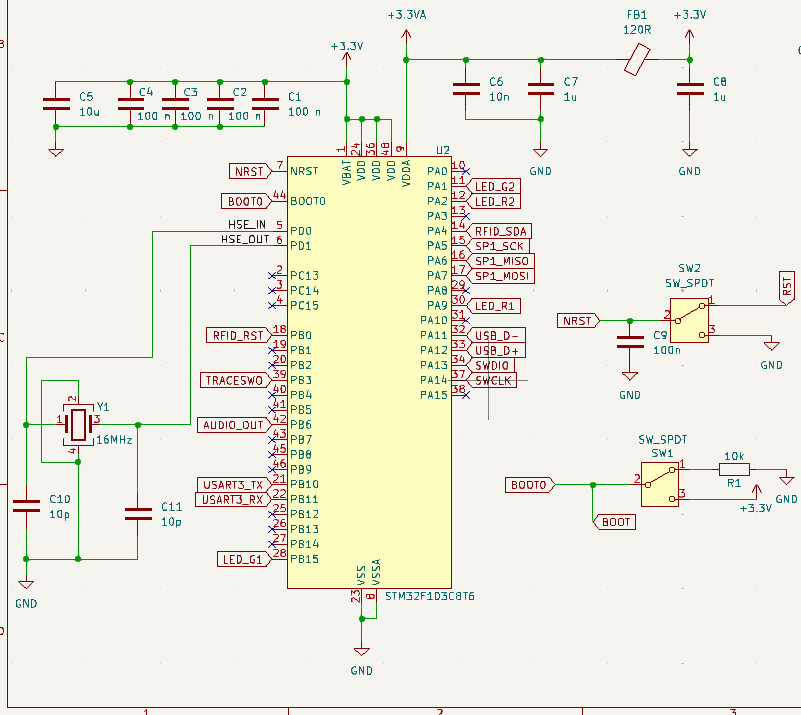

Schému zapojenia nášho microcontrolera vieme rozdeliť na 4 časti:

### 1. Decoupling
Decouplig používame pri pinoch VBAT, VDD a VDDA aby sme  zlepšili stabilitu napájacieho napätia a znížili elektrický šum.   
Pre decoupling pri pinoch VBAT a VDD používame štyri sériovo zapojéne 100 nF kondenzátory, za každý VBAT a VDD pin jeden, a jeden 4.7 μF kondenzátor.   
Pre decoupling pri pine VDDA používame seriovo zapojený 10nF a 1uF kondenzátor. Pre pripojenie k 3.3 voltom pridáme 100 ohmový Ferite Bead a 1uF kondenzátor pre pripojenie k zemi.  
Pri týchto hodnotách pre komponenty vychádzame zo schémy 14 na strane 36 z [datasheetu](data_sheet.pdf) 

### 2. Externý oscilátor
Náš STM32 mikrokontolér má síce vnútorný oscilátor ale aby sme mohli používať pripojenie cez USB tak potrebujeme pripojiť externý oscilátor. 
K oscilátoru budeme musieť pripojiť dva 10pF kondenzátory. Vychádzame z AN2867 

### 3. Prepínače pri pinoch NRST a BOOT0
Chceme aby sme vedeli náš mikrokontolér resetovať manuálne ale aj pomocou signálov. Preto tieto piny pripojíme k prepínačom ale aj k výstupom z RJ12 konektoru.
Rezistor pri pine BOOT0 môžeme a nemusíme použiť. 
Kondenzátor pri pine NRST slúži ako ochrana proti náhodným resetom. Minimálna hodnota kondenzátora by mala byť 0.1μF

### 4. Serial wire debug 
Pre debugovanie budeme používať 10 pinový SWD. Zapojenie je podľa tejto 
schémy:     

 

