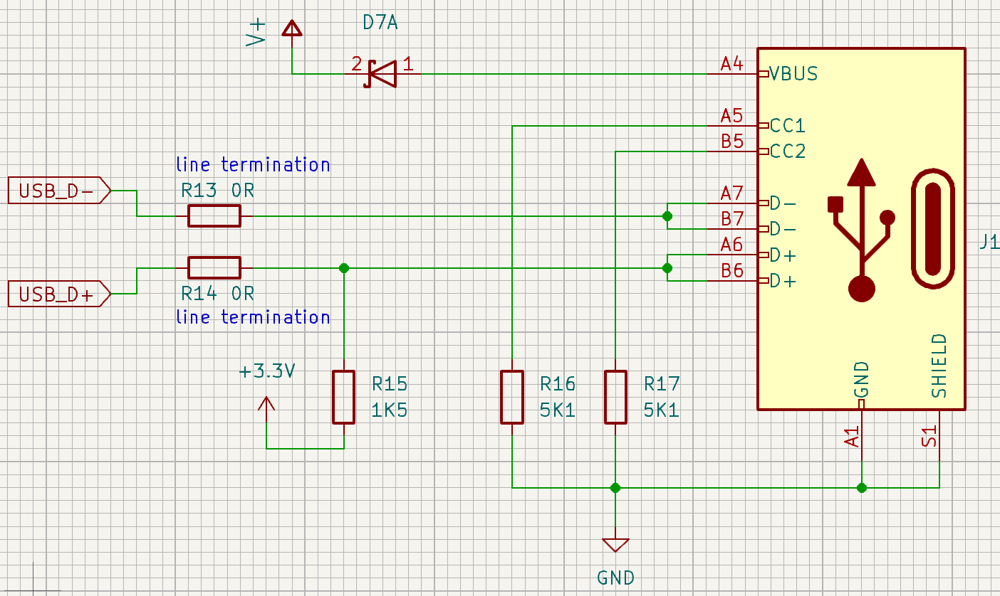
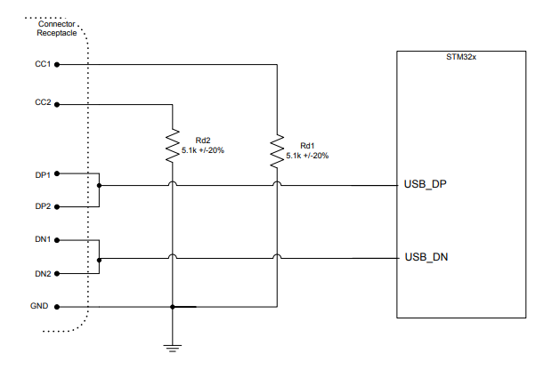

# USB interface

Tento USB interface je využitý v schéme readera v [projekte Deadlock](https://gitlab.com/project-deadlock). 

##  Schéma zapojenia

Schéma je z [aplikačnej poznámky](an1.pdf) na strane 19, Figure 10.

## Rozdelenie pinov

Tieto piny využívame v našej schéme, ostatné sa nachádzajú v [tabuľke 2](an1.pdf)  na strane 6 a 7.

| **Pin** | **Názov**       | **Popis**                                                                |
|---------|-----------------|--------------------------------------------------------------------------|
| A4      | VBUS            | Bus power                                                                |
| A5, B5  | CC1 alebo VCONN | Configuration channel or power for active or electronically marked cable |
| A6, B6  | D+              | USB2.0 Data line                                                         |
| A7, B7  | D-              | USB2.0 Data line                                                         |
| A1      | GND             | Ground return                                                            |

##  Komponenty a ich hodnoty

### Rezistory $R_{13}$ a $R_{14}$
Tieto rezistory nie sú potrebné, ale slúžia ako ukončovacie rezistory, ktoré zabraňujú odrážaniu signálu a tým zvyšujú jeho kvalitu.

### Rezistor $R_{15}$
Kvôli splneniu USB2.0 full-speed electrical špecifikácie, D+ pin musí byť pripojený s $1.5k\Omega$ pull up rezistorom na napätie v rozsahu 3.0 až 3.6V. Tento rezistor je niekedy zabudovaný na D+ linke, dá sa to overiť podľa [tabuľky 4](an2.pdf) na strane 3 a 4 v poslednom stĺpci.

### Rezistory $R_{16}$ a $R_{17}$
Podľa [tabuľky 6](an1.pdf) na strane 10 potrebujeme pripojiť na piny CC1 aj CC2 $5.1k\Omega$ pull-down rezistory